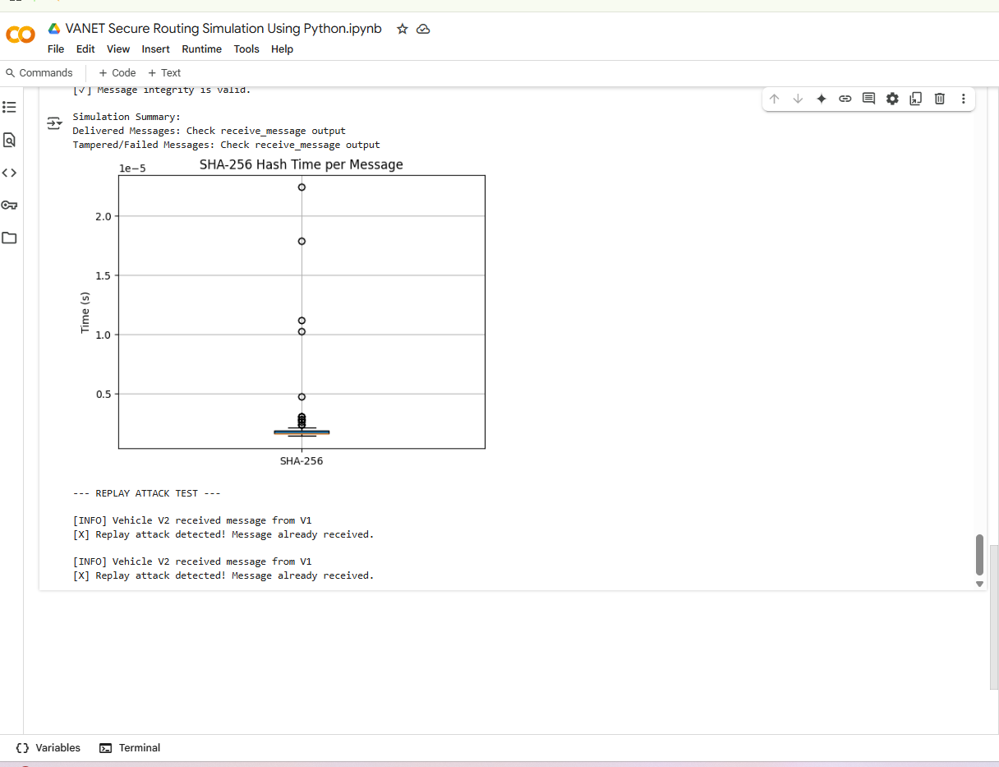
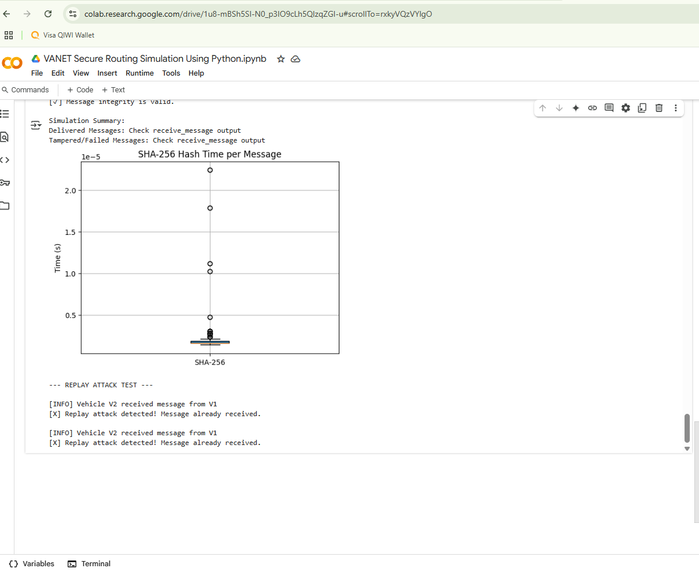

# VANET Secure Routing Simulation Using Python

## 📌 Overview

This project simulates secure routing in Vehicular Ad Hoc Networks (VANET) using Python. 
It implements SHA-256 based hashing for message integrity and detects cyber attacks such as impersonation and replay attacks.

## ✅ Key Features
- SHA-256 hashing with sender-specific salts
- Message integrity verification
- Impersonation attack detection
- Replay attack prevention using message history
- Performance analysis of hashing (timing graph)
- Visual output via matplotlib

## 📊 Simulation Output

### SHA-256 Hash Time per Message  

### Replay Attack Detection  

---

google drive output  
https://colab.research.google.com/drive/1daZvpwJN-RVujtpYGePa7RqfpQbh1rdF

## 🛠 How to Run

Use the Google Colab notebook below to run the simulation in your browser:

🔗 **[Open in Google Colab](https://colab.research.google.com/drive/1daZvpwJN-RVujtpYGePa7RqfpQbh1rdF)**

## 📄 Report

Refer to `VANET_Secure_Routing_Simulation_Report_FarahMae.docx` for a full write-up including project background, methodology, and results.

## 👩‍💻 Author

**Farah Mae Sumajit**  
---
